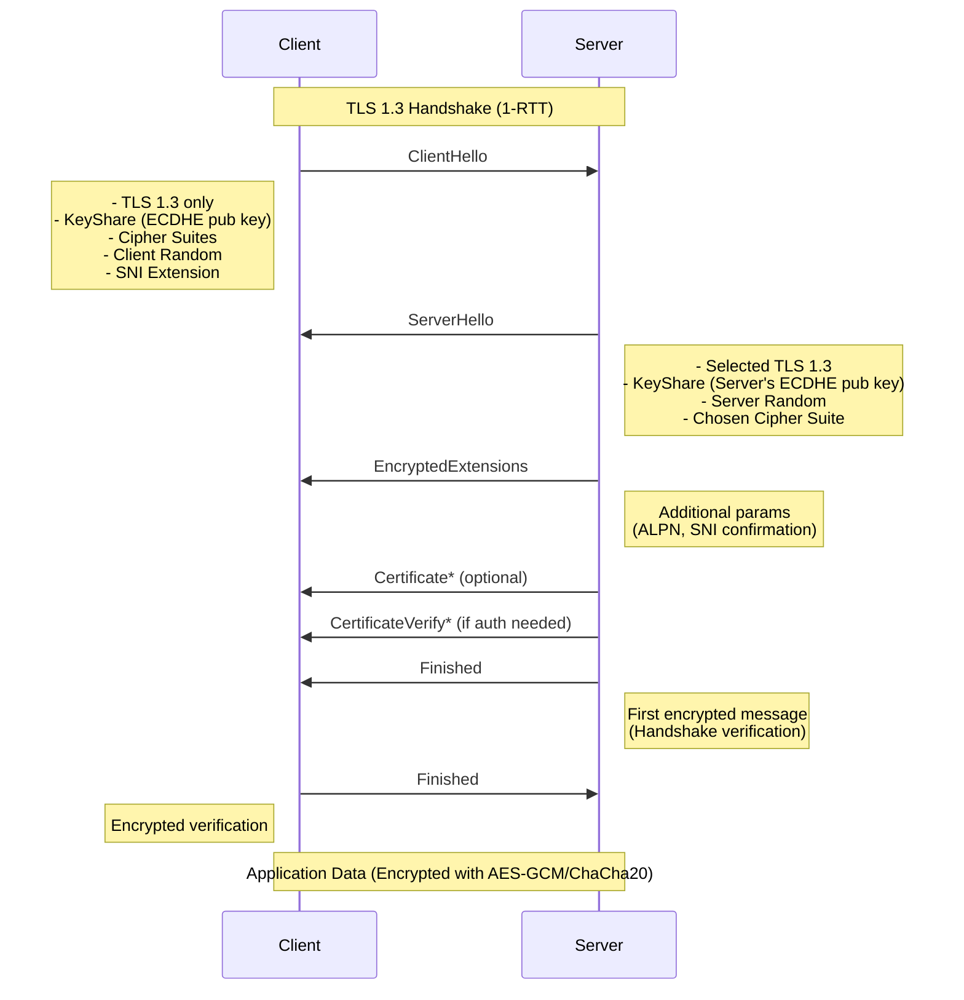

---

## 🔐 Deep Dive into TLS and Its Versions

> A complete and technical exploration of **Transport Layer Security (TLS)**, including version history, the TLS handshake, packet analysis with Wireshark, Root CAs, encryption principles, and modern best practices.

---

## 📖 Table of Contents

1. [What is TLS?](#1-what-is-tls)
2. [TLS Protocol Stack](#2-tls-protocol-stack)
3. [TLS Version History](#3-tls-version-history)
4. [TLS Handshake Process (with Simulation)](#4-tls-handshake-process-with-simulation)
5. [TLS Cryptographic Concepts](#5-tls-cryptographic-concepts)
6. [Root CAs and Certificate Chain](#6-root-cas-and-certificate-chain)
7. [Inspecting TLS Traffic with Wireshark](#7-inspecting-tls-traffic-with-wireshark)
8. [TLS Configuration Best Practices](#8-tls-configuration-best-practices)
9. [Common TLS Attacks](#9-common-tls-attacks)
10. [Resources](#10-resources)

---

## 1. What is TLS?

**TLS (Transport Layer Security)** is a cryptographic protocol used to secure communications over a network. It evolved from **SSL (Secure Sockets Layer)** and is designed to provide:

- **Encryption**: Ensures data is unreadable to attackers.
- **Authentication**: Validates the identity of the server (and optionally the client).
- **Integrity**: Confirms that data hasn’t been altered in transit.

TLS is widely used in:
- **HTTPS (Web traffic)**
- **Email (IMAPS, SMTPS)**
- **VPNs**
- **VoIP**
- **APIs & microservices**

---

## 2. TLS Protocol Stack

TLS operates between the **Transport Layer (TCP)** and **Application Layer (e.g., HTTP)**.

```
Application Layer       ← e.g., HTTP, SMTP
TLS/SSL Layer           ← TLS encryption/authentication
Transport Layer (TCP)   ← TCP connection
Network Layer (IP)
```

---

## 3. TLS Version History

| Version  | Release Year | Status       | Notable Features |
|----------|--------------|--------------|------------------|
| SSL 2.0  | 1995         | Deprecated   | Insecure         |
| SSL 3.0  | 1996         | Deprecated   | Vulnerable (POODLE) |
| TLS 1.0  | 1999         | Deprecated   | Based on SSL 3.0 |
| TLS 1.1  | 2006         | Deprecated   | Mitigates CBC attacks |
| TLS 1.2  | 2008         | Active       | Widely used, supports SHA-256 |
| TLS 1.3  | 2018         | Recommended  | Simplified, forward secrecy |

### 🆕 TLS 1.3 Highlights
- Removes legacy features (RSA key exchange, static DH, etc.)
- Zero-RTT support (faster reconnections)
- Only 5 cipher suites (vs 37 in TLS 1.2)
- Enforces **Forward Secrecy** by default

---

## 4. TLS Handshake Process (with Simulation)

### 📑 What is the TLS Handshake?

The TLS handshake is the process of negotiating security parameters and establishing a shared secret for encryption.

### 🔁 TLS 1.2 Handshake Steps


### **Simple & Detailed Explanation of TLS 1.2 Handshake**  

The **TLS 1.2 Handshake** is like a secure "handshake" between a **client** (your browser) and a **server** (a website). It ensures that:  
✅ The server is who it claims to be (authentication).  
✅ The connection is encrypted (privacy).  
✅ No one can tamper with the data (integrity).  

---

## **🔹 Step-by-Step TLS 1.2 Handshake**  

### **1️⃣ TCP Connection (Before TLS Starts)**  
- First, the **client** and **server** establish a basic connection (TCP 3-way handshake).  
- **Example**: Like dialing a phone number before speaking.  

---

### **2️⃣ ClientHello – "Hello Server, Here’s What I Support!"**  
📤 **Client → Server**  
- **What’s sent?**  
  - **TLS versions** (e.g., "I support TLS 1.2")  
  - **Cipher suites** (encryption methods, e.g., AES, RSA, ECDHE)  
  - **Client Random** (a random number for security)  
  - **Extensions** (e.g., SNI for websites with multiple domains)  

**Example**:  
> _"Hi Server! I speak TLS 1.2. Here are the encryption methods I know: AES, RSA. My random number is 1234."_  

---

### **3️⃣ ServerHello – "Okay, Let’s Use These Settings!"**  
📤 **Server → Client**  
- **What’s sent?**  
  - **Chosen TLS version** (e.g., "Let’s use TLS 1.2")  
  - **Selected cipher suite** (e.g., `TLS_ECDHE_RSA_WITH_AES_256_GCM_SHA384`)  
  - **Server Random** (another random number)  

**Example**:  
> _"Great! Let’s use TLS 1.2 with AES-256 encryption. My random number is 5678."_  

---

### **4️⃣ Server Certificate – "Here’s My ID!"**  
📤 **Server → Client**  
- The server sends its **SSL certificate** (issued by a trusted CA).  
- The client checks if the certificate is **valid & trusted** (like checking a passport).  

**Example**:  
> _"Here’s my certificate from DigiCert. You can trust me!"_  

---

### **5️⃣ ServerKeyExchange (Optional) – "Let’s Agree on a Secret!"**  
📤 **Server → Client**  
- Only needed for **Diffie-Hellman (DH) or ECDHE** (for forward secrecy).  
- The server sends **public key parameters** to establish a shared secret.  

**Example**:  
> _"Let’s use ECDHE to generate a secret key. Here’s my part: (public key)."_  

---

### **6️⃣ ServerHelloDone – "My Turn Is Over!"**  
📤 **Server → Client**  
- The server says: _"I’ve sent all my info. Your turn!"_  

---

### **7️⃣ ClientKeyExchange – "Here’s My Part of the Secret!"**  
📤 **Client → Server**  
- The client generates a **pre-master secret** (encrypted with the server’s public key).  
- Both sides now compute the **same session keys** using:  
  - Client Random  
  - Server Random  
  - Pre-Master Secret  

**Example**:  
> _"I’ve computed our secret key. Let’s use it to encrypt messages!"_  

---

### **8️⃣ ChangeCipherSpec – "Let’s Switch to Encryption!"**  
📤 **Client → Server**  
- The client says: _"From now on, all messages will be encrypted!"_  

---

### **9️⃣ Finished (Encrypted) – "Let’s Verify Everything!"**  
📤 **Client → Server**  
- First **encrypted** message.  
- Contains a **hash** of all previous handshake messages to ensure no tampering.  

**Example**:  
> _(Encrypted) "Did everything look good on your side?"_  

---

### **🔟 Server’s ChangeCipherSpec & Finished – "Yes, All Good!"**  
📤 **Server → Client**  
- The server also switches to encryption.  
- Sends its own **Finished** message (encrypted).  

**Example**:  
> _(Encrypted) "Yes, everything checks out!"_  

---

## **🎉 Handshake Complete! Secure Connection Established!**  
Now, all data sent between **client** and **server** is **encrypted**.  

---

## **🔹 TLS 1.2 vs TLS 1.3 (Simplified)**  
| Feature | TLS 1.2 | TLS 1.3 |
|---------|---------|---------|
| **Handshake Speed** | 2 round trips (slower) | 1 round trip (faster) |
| **Key Exchange** | RSA or ECDHE | Only ECDHE (more secure) |
| **Encryption** | AES-CBC or AES-GCM | Only AES-GCM (better security) |
| **Downgrade Attacks** | Possible | Prevented |

---

## **📌 Summary**  
1. **ClientHello & ServerHello** → Agree on encryption.  
2. **Certificate** → Server proves identity.  
3. **Key Exchange** → Generate secret keys securely.  
4. **ChangeCipherSpec** → Switch to encryption.  
5. **Finished** → Verify handshake integrity.  

**Now, the browser & server can communicate securely!** 🔒  

Would you like a **Wireshark capture example** of this handshake? 🚀

Here's a detailed **TLS 1.3 Handshake Diagram** with step-by-step explanations:



---

## **🔍 Detailed Explanation of TLS 1.3 Handshake**

### **🚀 Key Improvements Over TLS 1.2**
- **1 Round Trip (1-RTT)** instead of 2 (faster connections)
- **Removed insecure features** (RSA key exchange, static DH, compression)
- **Mandatory Perfect Forward Secrecy (PFS)** via ECDHE
- **Simplified cipher suites** (only AEAD modes like AES-GCM)

---

### **📌 Step-by-Step Breakdown**

#### **1️⃣ ClientHello**
📤 **Client → Server**  
- **TLS 1.3 only** (no fallback to older versions)
- **KeyShare Extension**: Client's ECDHE public key (for immediate key exchange)
- **Supported Cipher Suites**: e.g., `AES256-GCM-SHA384`
- **Client Random**: 32-byte cryptographic nonce
- **SNI (Server Name Indication)**: Specifies the target website

**Example**:  
> _"Hi Server! I only speak TLS 1.3. Here’s my ECDHE public key (X25519). Let’s use AES256-GCM. My random number is 1234. I want example.com."_

---

#### **2️⃣ ServerHello**
📤 **Server → Client**  
- **Confirms TLS 1.3**
- **KeyShare Extension**: Server's ECDHE public key
- **Server Random**: Another 32-byte nonce
- **Selected Cipher Suite**: e.g., `AES256-GCM-SHA384`

**Key Generation**:  
Both sides now compute the **shared secret** using ECDHE:  
```
Client Private Key + Server Public Key = Shared Secret  
Server Private Key + Client Public Key = Same Shared Secret  
```

**Example**:  
> _"OK! TLS 1.3 it is. Here’s my ECDHE public key. Let’s use AES256-GCM. My random number is 5678."_

---

#### **3️⃣ EncryptedExtensions**
📤 **Server → Client**  
- Sent **after keys are established** (unlike TLS 1.2)
- Contains optional extensions like:
  - **ALPN (Application-Layer Protocol Negotiation)**: e.g., `h2` for HTTP/2
  - **SNI Confirmation**

**Example**:  
> _(Encrypted) "BTW, we’ll use HTTP/2 for this connection."_

---

#### **4️⃣ Certificate* (Optional)**
📤 **Server → Client**  
- Only sent if the server needs to authenticate (most websites do)
- **No certificate chain** (client must know intermediate CAs)
- Uses **efficient certificate compression** in TLS 1.3

**Example**:  
> _(Encrypted) "Here’s my ID (certificate) issued by Let’s Encrypt."_

---

#### **5️⃣ CertificateVerify* (Optional)**
📤 **Server → Client**  
- Proves the server **owns the private key** for the certificate
- Uses **digital signature** over handshake messages

**Example**:  
> _(Encrypted) "Here’s proof I own this certificate (signed handshake hash)."_

---

#### **6️⃣ Finished**
📤 **Server → Client**  
- First **encrypted** message
- Contains **HMAC** of all handshake messages to verify integrity

**Example**:  
> _(Encrypted) "Let’s confirm nothing was tampered: HMAC=xyz123."_

---

#### **7️⃣ Client Finished**
📤 **Client → Server**  
- Client’s turn to send an encrypted **Finished** message
- Final verification before secure data transfer

**Example**:  
> _(Encrypted) "Everything checks out! HMAC=abc456."_

---

### **🎉 Handshake Complete!**
Now all communication is encrypted with:  
- **Session Keys** (derived from ECDHE shared secret + randoms)  
- **AEAD Cipher** (e.g., AES256-GCM or ChaCha20-Poly1305)  

---

## **🆚 TLS 1.2 vs TLS 1.3 Comparison**
| Feature          | TLS 1.2                      | TLS 1.3                      |
|------------------|------------------------------|------------------------------|
| **Handshake**    | 2 round trips                | 1 round trip (faster)        |
| **Key Exchange** | RSA or ECDHE                 | Only ECDHE (stronger PFS)    |
| **Ciphers**      | CBC + HMAC (vulnerable)      | Only AEAD (AES-GCM, ChaCha20)|
| **Secrets**      | Derived after handshake      | Derived immediately          |
| **Downgrade**    | Possible                     | Impossible                   |

---

## **🔐 Why TLS 1.3 is More Secure?**
1. **No RSA Key Exchange** → Prevents decryption if server key is compromised  
2. **No Weak Ciphers** → Removes CBC, RC4, SHA1  
3. **Forward Secrecy by Default** → Each session has unique keys  
4. **Encrypted Handshake** (after ServerHello) → Hides metadata  

---

## **📊 Wireshark View (TLS 1.3)**
```
1. ClientHello          → Visible (unencrypted)
2. ServerHello          → Visible (unencrypted)
3. All Other Messages   → Encrypted (as "Application Data")
```

---

## **💡 Practical Implications**
- **Faster HTTPS** (especially on mobile) due to 1-RTT  
- **Better Security** against MITM and downgrade attacks  
- **Harder to Debug** (most handshake is encrypted)  

Would you like a **real-world packet capture example**? 🚀

---

## 5. TLS Cryptographic Concepts

### 🔐 Symmetric vs Asymmetric Encryption

- **Symmetric**: Same key used for encryption/decryption (AES, ChaCha20)
- **Asymmetric**: Public/private key pair used (RSA, ECC)

TLS uses:
- **Asymmetric** during handshake (to securely share keys)
- **Symmetric** during session (for performance)

### 🧩 Key Terms

- **Session Key**: Secret key used for data encryption after handshake
- **MAC (Message Authentication Code)**: Verifies data integrity
- **Forward Secrecy**: Compromising long-term keys doesn’t affect past sessions

---

## 6. Root CAs and Certificate Chain

### 🏛️ What is a Root CA?

A **Certificate Authority (CA)** is a trusted third party that issues digital certificates, vouching for the authenticity of websites.

### 🧱 Certificate Chain Example

```
[Root CA] → [Intermediate CA] → [Server Certificate]
```

- Browsers/OS trust **Root CAs**.
- Servers present **Server Certificate** issued by an Intermediate CA.

### 📜 Inspect Certificate Chain

```bash
openssl s_client -connect github.com:443 -showcerts
```

You’ll see the full certificate chain.

---

## 7. Inspecting TLS Traffic with Wireshark

### 🧪 Capture Packets

1. Start **Wireshark**
2. Filter: `tcp.port == 443`
3. Open browser → Visit a TLS-secured website
4. Observe:
   - ClientHello
   - ServerHello
   - Certificate
   - Finished

### 🔓 (Optional) Decrypt TLS Traffic

For test environments, use:

```bash
export SSLKEYLOGFILE=~/ssl-keys.log
```

Add the file to Wireshark (Preferences > TLS) to view decrypted traffic.

---

## 8. TLS Configuration Best Practices

### 🔧 Web Server (Nginx) Example

```nginx
ssl_protocols TLSv1.2 TLSv1.3;
ssl_prefer_server_ciphers on;
ssl_ciphers 'TLS_AES_128_GCM_SHA256:TLS_AES_256_GCM_SHA384:ECDHE-ECDSA-AES256-GCM-SHA384';
ssl_session_timeout 1d;
ssl_session_cache shared:SSL:50m;
```

### ✅ Additional Security Headers

- `Strict-Transport-Security`
- `X-Frame-Options: DENY`
- `X-Content-Type-Options: nosniff`

---

## 9. Common TLS Attacks

| Attack Name | Description |
|-------------|-------------|
| POODLE      | SSL 3.0 CBC vulnerability |
| BEAST       | TLS 1.0 CBC attack |
| CRIME       | TLS compression attack |
| Heartbleed  | OpenSSL buffer over-read |
| MITM        | Man-in-the-Middle (certificate spoofing) |

### 💡 Mitigation Tips

- Disable SSL/TLS 1.0/1.1
- Use strong ciphers (AES-GCM, ChaCha20)
- Regularly update OpenSSL/NSS libraries

---

## 10. Resources

- 📜 [RFC 8446 – TLS 1.3](https://datatracker.ietf.org/doc/html/rfc8446)
- 🛠 [Mozilla SSL Configuration Tool](https://ssl-config.mozilla.org/)
- 📘 [Wireshark TLS Decryption Guide](https://wiki.wireshark.org/TLS)
- 📚 [Let’s Encrypt Documentation](https://letsencrypt.org/docs/)
- 🔍 [Qualys SSL Labs Test](https://www.ssllabs.com/ssltest/)

---

