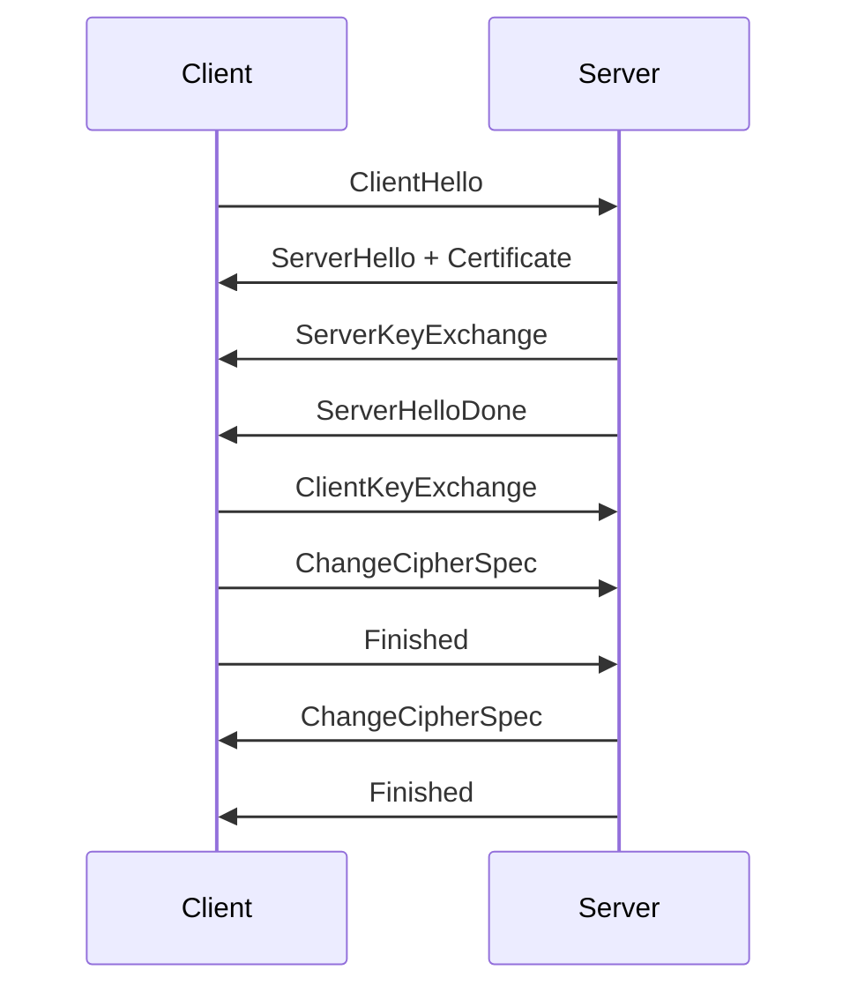
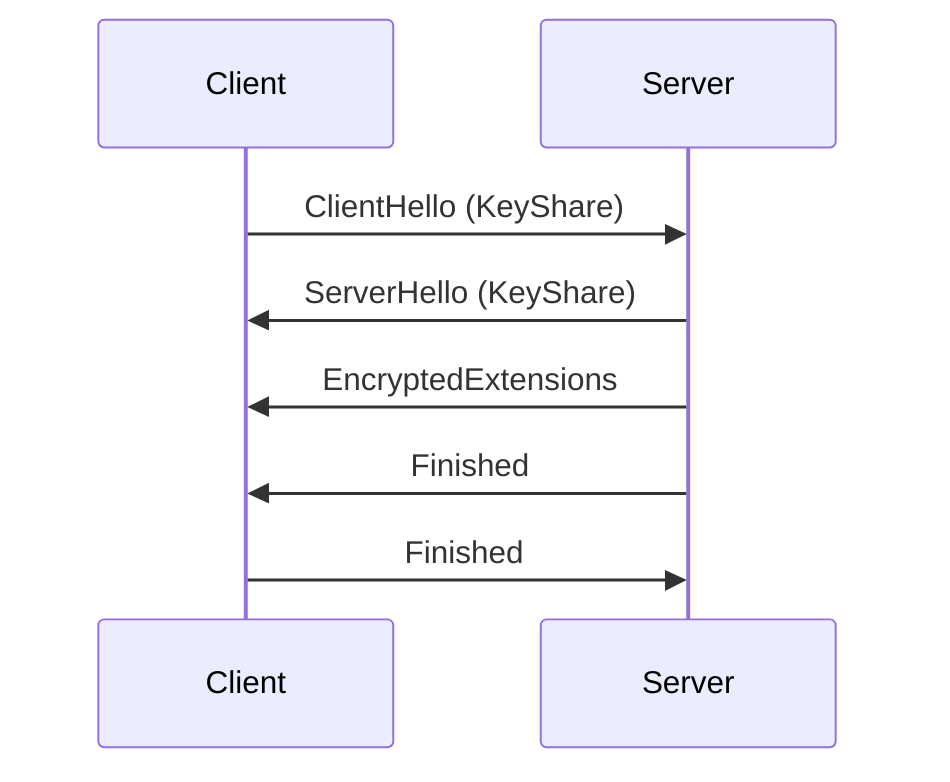

## 🛡️ Deep Dive into TLS: A Comprehensive Guide


A complete repository exploring Transport Layer Security (TLS) protocols, from fundamental concepts to advanced packet analysis.

## 📚 Table of Contents

1. [Introduction](#-introduction)
2. [TLS Version Evolution](#-tls-version-evolution)
3. [Handshake Processes](#-handshake-processes)
4. [Wireshark Analysis](#-wireshark-analysis)
5. [Certificate Authority](#-certificate-authority)
6. [Security Considerations](#-security-considerations)
7. [Performance Optimization](#-performance-optimization)
8. [Code Examples](#-code-examples)
9. [Advanced Topics](#-advanced-topics)
10. [Contributing](#-contributing)

## 🌐 Introduction

**Transport Layer Security (TLS)** is the cryptographic protocol that powers secure internet communication. This repository provides:

- Comparative analysis of all TLS versions
- Hands-on packet capture guides
- Certificate chain verification techniques
- Security best practices

```bash
# Quick verification command
openssl s_client -connect example.com:443 -servername example.com
```

## 🔄 TLS Version Evolution

| Version | Year | Status | Key Features |
|---------|------|--------|--------------|
| SSL 3.0 | 1996 | ❌ Deprecated | First widely used version |
| TLS 1.0 | 1999 | ❌ Deprecated | Official IETF standard |
| TLS 1.1 | 2006 | ❌ Deprecated | CBC protection |
| TLS 1.2 | 2008 | ✅ Recommended | AEAD ciphers |
| TLS 1.3 | 2018 | ✅ Best choice | 1-RTT handshake |

## 🤝 Handshake Processes

### TLS 1.2 Handshake (2-RTT)


### TLS 1.3 Handshake (1-RTT)


## 🔍 Wireshark Analysis

**Essential Filters:**
```wireshark
# Basic TLS filter
tls

# Specific handshake messages
tls.handshake.type == 1  # ClientHello
tls.handshake.type == 2  # ServerHello

# Version filtering
tls.handshake.version == 0x0303  # TLS 1.2
tls.handshake.version == 0x0304  # TLS 1.3
```

**Decryption Setup:**
1. Set environment variable:
   ```bash
   export SSLKEYLOGFILE=$HOME/tls-keys.log
   ```
2. Configure Wireshark:  
   `Preferences → Protocols → TLS → (Pre)-Master-Secret log filename`

## 📜 Certificate Authority

**Certificate Chain Verification:**
```bash
# View full chain
openssl s_client -connect example.com:443 -showcerts

# Verify certificate
openssl verify -CAfile ca-bundle.crt server.crt
```

**Common Issues:**
- 🔴 Expired certificates
- 🔴 Name mismatch (CN vs SAN)
- 🔴 Untrusted root CA
- 🔴 Revoked certificates (check via OCSP)

## 🛡️ Security Considerations

**Critical Vulnerabilities:**
| Vulnerability | Affected Versions | Mitigation |
|---------------|-------------------|------------|
| POODLE | SSL 3.0 | Disable SSL |
| BEAST | TLS 1.0 | Use TLS 1.2+ |
| CRIME | TLS Compression | Disable compression |
| DROWN | SSLv2 | Disable SSLv2 |

## ⚡ Performance Optimization

**Best Practices:**
- ✅ Enable TLS 1.3 (faster handshake)
- ✅ Implement OCSP Stapling
- ✅ Use session tickets for resumption
- ✅ Prefer ECDHE over RSA key exchange
- ✅ Enable False Start (when possible)

## 💻 Code Examples

**Python TLS Client:**
```python
import ssl, socket

hostname = "example.com"
ctx = ssl.create_default_context()

# Force modern configuration
ctx.minimum_version = ssl.TLSVersion.TLSv1_2
ctx.set_ciphers('ECDHE-ECDSA-AES256-GCM-SHA384:ECDHE-RSA-AES256-GCM-SHA384')

with socket.create_connection((hostname, 443)) as sock:
    with ctx.wrap_socket(sock, server_hostname=hostname) as ssock:
        print(f"Protocol: {ssock.version()}")
        print(f"Cipher: {ssock.cipher()}")
        print(f"Certificate: {ssock.getpeercert()}")
```

## 🚀 Advanced Topics

1. **Mutual TLS (mTLS)**
   - Client certificate authentication
   - Implementation guides

2. **Certificate Pinning**
   - HPKP (HTTP Public Key Pinning)
   - Android/iOS pinning techniques

3. **Post-Quantum Cryptography**
   - Quantum-resistant algorithms
   - Hybrid key exchange

## 🤝 Contributing

We welcome contributions! Please:

1. Fork the repository
2. Create a feature branch
3. Submit a pull request

**Reporting Issues:**
- Provide Wireshark captures when possible
- Include OpenSSL debug output
- Specify TLS library/version

## 📜 License

MIT License - See [LICENSE](LICENSE) for details.

---

<p align="center">
  <em>Keep connections secure! 🔒</em>
</p>
```


